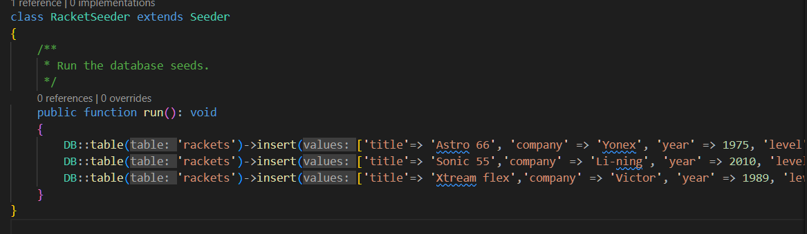

# Badminton Racket Store - CRUD Management Using Laravel 🎉

This guide walks through setting up a basic CRUD (Create, Read, Update, Delete) application using Laravel to manage a database of badminton rackets for a store. 🏸

First of all, I installed Composer. If you need help with that, refer to [installing Composer](installing_composer.md).

## Setting Up the Database 🗄️

First, let's set up the `racket_store` database where we will keep information about the rackets available in the store.

### Preparing the `rackets` Table
1. Open phpMyAdmin and select the `racket_store` database.
2. Deleted any existing table named `rackets` (Laravel will recreate it for us later). 
   - In phpMyAdmin, I created the table called rackets.
   

## Created a Laravel Project 🚀

1. I had Xampp installed in my local machine so I run the command `composer create-project --prefer-dist laravel/laravel BADMINTION_RACKET_STORE` in my terminal.
   ```bash
   cd htdocs
   ```
2. Run the following command to create a new Laravel project. This will initialize the basic structure of the application.
   ```bash
   composer create-project --prefer-dist laravel/laravel BADMINTION_RACKET_STORE
   ```

## Configuring Laravel for `racket_store` Database⚙️

1. Next step I updated my database details in `.env` file in Laravel project folder and set up the database details like this:
   ```env
   DB_CONNECTION=mysql
   DB_HOST=127.0.0.1
   DB_PORT=3306
   DB_DATABASE=racket_store
   DB_USERNAME=cht2520
   DB_PASSWORD=*******
   ```

2. Saved the file. Laravel will now connect to `racket_store` when I run the application

## Creating the Rackets Model and Migration 🛠️

1. Generated a model and migration for the `rackets` table by running:
   ```bash
   php artisan make:model Racket -m
   ```
2. I opened the migration file in database/migrations/ and defined the table structure for storing racket information.
   ```php
    Schema::create('rackets', function (Blueprint $table) {
            $table->id();
            $table->string('title');
            $table->string('level');
            $table->string('company');
            $table->smallInteger('year');
            $table->timestamps();
        });
   ```
3. Run the migration to create the table:
   ```bash
   php artisan migrate
   ```

## Setting Up Basic CRUD Functionality 📚

### Creating Racket Routes and Controller
1. Generate a controller to handle racket data with:
   ```bash
   php artisan make:controller RacketController --resource
   ```
2. In `routes/web.php`, added the following route to link to the `RacketController`:
   ```php
   Route::get('/rackets', [RacketController::class, 'index']);
   Route::get('/rackets/create', [RacketController::class, 'create']);
   Route::get('/rackets/about', [RacketController::class, 'about']);
   Route::post('/rackets', [RacketController::class, 'store']);
   Route::get('/rackets/{id}', [RacketController::class, 'show']);
   Route::get('/rackets/{id}/edit', [RacketController::class, 'edit']);
   Route::patch('/rackets', [RacketController::class, 'update']);
   Route::delete('/rackets', [RacketController::class, 'destroy']);
   ```
### Seeding the Database 🌱
1. Created a seeder to populate the `rackets` table with some initial data:
```php
   php artisan make:seeder RacketSeeder
   ```
   

### Building CRUD Methods in the Controller 📝
Edit `RacketController.php` to add CRUD methods for the rackets in your store.

- **Index**: Lists all rackets.
- **Create**: Form to add a new racket.
- **Store**: Saves new racket details to the database.
- **Show**: Displays a specific racket’s details.
- **Edit**: Form to edit an existing racket.
- **Update**: Saves updated details of a racket.
- **Destroy**: Deletes a racket.

### Created Blade Views  🖥️
Created Blade templates (`.blade.php` files) for each page in 


`

## Running and Testing the Application 🏃‍♂️
1. Start the Laravel development server with:
   ```bash
   php artisan serve
   ```
2. Opened a browser and tested `http://localhost/rackets` to see and interact with your rackets store.

 

# RacketController - Handling CRUD Operations for Badminton Rackets 🎾

The `RacketController` manages all operations related to badminton rackets in the application. This controller handles Create, Read, Update, and Delete operations along with validation for form data.
## Explanation of Each Method

### `index(Request $request)`

- Retrieves and displays a list of rackets with optional search functionality.
- Sanitizes the search input, removing special characters, and searches through the title and company fields.
- Returns paginated results along with the total number of rackets in the database.

### `create()`

- Returns the view to create a new racket. This view contains a form to add new racket details.

### `about()`

- Displays a list of all available rackets for informational purposes.

### `store(Request $request)`

- Validates the form data and stores a new racket in the database.
- Redirects the user back to the rackets listing with a success message.

### `show($id)`

- Retrieves and displays the details of a specific racket based on the provided id.

### `edit($id)`

- Displays a form pre-filled with the racket’s details for editing purposes.

### `update(Request $request)`

- Validates the updated form data and saves changes to the racket in the database.
- Redirects to the rackets listing with a success message.

### `destroy(Request $request)`

- Deletes a racket from the database based on the id provided in the request.
- Redirects the user back to the rackets index with a success message.

### `validateRacket(Request $request)`

- Validates the input data for creating or updating a racket, ensuring that required fields are provided and the data meets certain conditions (e.g., valid year, valid level and a valid company name and in years I have put the validation that the year of the racket is not more than the current year and not less than 1900).

### CRUD Operations

The controller implements basic CRUD operations:

- **Create:** Users can add new rackets to the store.
- **Read:** Users can view the list of all rackets or details of individual rackets.
- **Update:** Users can edit racket information.
- **Delete:** Users can remove rackets from the store.


### Created Blade Views 🖼️
* Created Blade templates (`.blade.php` files) for each page in `resources/views/rackets`. Below is the implementation of the `index.blade.php` file, which serves as the main view for displaying the list of badminton rackets:


* This structured explanation will help clarify each part of the `index.blade.php` file and provide a comprehensive understanding of its functionality. ```markdown
 ### Racket List Page - `index.blade.php` 📋

   * The `index.blade.php` file serves as the main view for displaying the list of badminton rackets. Below are the key components of this file explained step-by-step:

#### 1. Validations ✅

* Before displaying the rackets, we check for any session messages that indicate success or error states. This is crucial for user feedback after actions like adding or updating a racket. The following code snippets handle these validations using **Laravel**:

```blade
@if (session('success'))
<div class="alert alert-success">
    {{ session('success') }}
</div>
@endif

@if (session('error'))
<div class="alert alert-danger">
    {{ session('error') }}
</div>
@endif
```

This ensures users are informed of the results of their actions, enhancing the user experience.

#### 2. Search Bar 🔍
 * A search bar is provided at the top of the page to allow users to find specific rackets by
```blade
<form method="GET" action="{{ url('/rackets') }}" class="search-form">
    <input type="text" name="search" value="{{ request('search') }}" placeholder="Search for a racket..." class="search-input" />
    <button type="submit" class="search-button">Search</button>
</form>
```
* When a user types a query and submits the form, it triggers a `GET` request to the /rackets route, enabling the application to fetch and display only the relevant rackets that match the search criteria. 

#### 3. Displaying Rackets 🏷️

* The main section of the view iterates through the $rackets collection and displays each racket's details, including the title, company, year, and level. This is done using a simple loop:

```blade
<div class="racket-list">
    @foreach ($rackets as $racket)
        <div class="racket-item">
            <h2>
                <a href="/rackets/{{$racket->id}}">
                    {{$racket->title}}
                </a>
            </h2>
            <p><strong>Company:</strong> {{$racket->company}}</p>
            <p><strong>Year:</strong> {{$racket->year}}</p>
            <p><strong>Level:</strong> {{$racket->level}}</p>
        </div>
    @endforeach
</div>
```

#### 4. Pagination 📄
* To handle large collections of rackets, pagination is implemented using Laravel's built-in pagination feature. This

```blade
<div class="pagination-info">
    @if(request('search'))
        <p>There are {{ $rackets->total() }} results for "{{ request('search') }}". Page {{ $rackets->currentPage() }} of {{ $rackets->lastPage() }}</p>
    @else
        <p>There are {{ $totalRackets }} rackets available. Page {{ $rackets->currentPage() }} of {{ $rackets->lastPage() }}</p>
    @endif
</div>

<div class="pagination">
    {{ $rackets->appends(request()->query())->links('vendor.pagination.bootstrap-4') }}
</div>
```
* This code displays the total number of rackets, current page number, and the total number of pages

* The index.blade.php file effectively combines validations, search functionality, and pagination to create a user-friendly interface for managing badminton rackets. Each component plays a vital role in enhancing the overall experience of the application.

### Racket Details Page - `show.blade.php`  📖

* The `show.blade.php` file is responsible for displaying the detailed information of a specific badminton racket. This view allows users to see all the relevant details about a racket and provides options to edit or delete it. Below are the key components of this file explained step-by-step:

#### 1. Layout Structure

* The file begins by extending a layout component with a title that indicates the purpose of the page:

```blade
<x-layout title="Show the details of all rackets">
```
* The file begins by extending a layout component, which allows it to inherit common styling and structure. The title provided will typically be displayed in the page header.

### 2. Racket Information Display


```blade
<div class="racket-details">
    <h1>{{$racket->title}}</h1>
    <h2>{{$racket->company}}</h2>
    <p><strong>Year:</strong> {{$racket->year}}</p>
    <p><strong>Level:</strong> {{$racket->level}}</p>
</div>
```
 #### This section displays key details about the racket:

- **Title:** The name of the racket is shown as a primary heading (`<h1>`).
- **Company:** The manufacturer of the racket is displayed as a secondary heading (`<h2>`).
- **Year:** The year the racket was released is presented with a label.
- **Level:** The skill level for which the racket is intended is also shown with a label.

### 3. Action Buttons ⚙️
```blade

<div class="button-group">
    <button><a href='/rackets/{{$racket->id}}/edit'>Edit</a></button>

    <form method='POST' action='/rackets' style="display:inline;">
        @csrf
        @method('DELETE')
        <input type="hidden" name="id" value="{{$racket->id}}">
        <button type='submit'>Delete</button>
    </form>
</div>
``` 

* **Edit Button:** This button provides a link to an edit page for the racket, allowing users to modify its details. It uses the racket's ID to construct the URL.

* **Delete Form:** This form allows users to delete the racket. It includes:

   * **CSRF Token:** `@csrf` ensures that the request is secure against cross-site request forgery.
   * **Hidden Input:** Contains the racket's ID, which is necessary for identifying which racket to delete.
   * **Delete Button:** A button that submits the form to delete the racket. The `@method('DELETE')` directive specifies that the form should be treated as a DELETE request

### 4. Inline Form Display

* The delete form is styled to display inline with the edit button, creating a cohesive user interface that allows for easy access to both actions without cluttering the layout.

   *  The show.blade.php file effectively displays detailed information about a specific racket while providing users with options to edit or delete it. This ensures a user-friendly experience, allowing for quick actions directly from the details page. The use of Blade syntax allows for dynamic content rendering, making the page interactive and functional.


### Create Racket Page - `create.blade.php`  ✏️

The `create.blade.php` file serves as a user interface for adding a new racket to the database. It is structured similarly to the edit form, featuring a form that submits a POST request to create a new racket entry. 

The form includes input fields for the racket's **title**, **company**, **year**, and **level**, enabling users to provide the necessary details. Each input field is equipped with validation error messages to ensure that the submitted data adheres to the required standards. Users can submit the form using a "Save" button, which initiates the creation of the new racket record in the system. Overall, this file provides a straightforward and user-friendly method for creating new racket entries.

### Edit Racket Page - `edit.blade.php` ✍️ 

The `edit.blade.php` file is designed to allow users to modify the details of a specific racket. Below is a summary of its components:

#### 1. Layout Structure 

```blade
<x-layout title="Edit product type">
```

* The file begins by extending a layout component, setting the title to "Edit product type."

### 2. Edit Form :keyboard: 
```blade
<form action="/rackets" method="POST">
    @csrf
    @method('PATCH')
    <input type="hidden" name="id" value="{{$racket->id}}">
```
* The form is set to submit a PATCH request to update the racket's details. It includes:

* :warning: **CSRF Token:** @csrf for security.
* **Hidden Input:** Contains the racket's ID for identification during the update.

### 3. Input Fields :boom:

The form includes fields for editing the racket's details:

**Title:**
```blade
<input type="text" id="title" name="title" value="{{$racket->title}}">
@error('title')
    <div class="error-message">{{ $message }}</div>
@enderror 
```
**Company:**

```blade
<input type="text" id="company" name="company" value="{{$racket->company}}">
@error('company')
    <div class="error-message">{{ $message }}</div>
@enderror
```
**Year:**

```blade
<input type="number" id="year" name="year" value="{{$racket->year}}">
@error('year')
    <div class="error-message">{{ $message }}</div>
@enderror
```
**Level: Radio buttons for selecting the skill level:**

```blade
<label>
    <input type="radio" name="level" value="beginner" {{ $racket->level == 'beginner' ? 'checked' : '' }}> Beginner
</label>
<label>
    <input type="radio" name="level" value="amateur" {{ $racket->level == 'amateur' ? 'checked' : '' }}> Amateur
</label>
<label>
    <input type="radio" name="level" value="professional" {{ $racket->level == 'professional' ? 'checked' : '' }}> Professional
</label>
@error('level')
    <div class="error-message">{{ $message }}</div>
@enderror
```
### 4. Submit Button :handshake:
```blade
<button type="submit">Save Changes</button>
````
- A button to submit the form and save the changes made to the racket's details.
- The `edit.blade.php` file provides a user-friendly interface for editing racket details, ensuring that all necessary information is captured and validated before submission.

